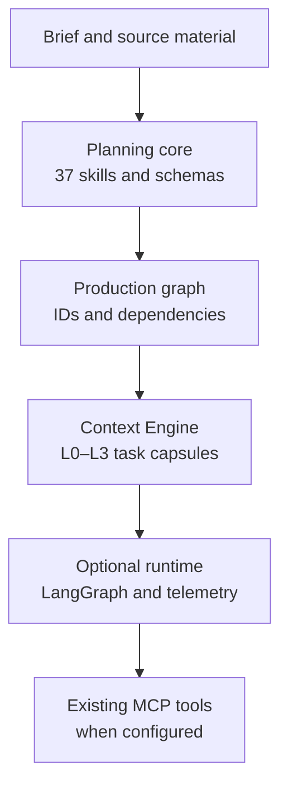

# Cine Agent Skills

[](https://github.com/Arkus61/cine-agent-skills/actions/workflows/ci.yml)
[](https://www.python.org/)
[](docs/versioning.md)
[](LICENSE)
[](CHANGELOG.md)

<p align="center">
  <strong>Film planning as a traceable system.</strong><br>
  Source-bound creative decisions, stable artifact contracts, and optional recoverable execution.
</p>

Cine Agent Skills is a portable, source-conscious Agent Skills system for film
story development, screenplay work, scene preproduction, creative production,
and postproduction. It turns a brief into reviewable planning artifacts while
preserving the difference between supplied facts, assumptions, proposals,
uncertainties, and evidence.

The active system contract is **0.3.0** (user-facing label **0.3**). Functional
profiles describe package completeness; they are not separate product
generations.

> **Current boundary.** The planning core works offline and does not require a
> paid model, media-generation service, live DCC, or network access. Optional
> runtime features use maintained community components. Blender, when enabled,
> is reached only through the user's already configured community MCP; this
> repository does not ship a replacement connector or protocol.

## What is included

- **37 project-local skills** for story, screenplay, scene, production,
  postproduction, and orchestration work.
- **Machine-checkable contracts**: JSON Schema, stable IDs, manifests,
  cross-reference validation, provenance, and explicit evidence states.
- **Offline-first CLI** for artifact, scene-package, layer, and full-project
  validation with deterministic JSON reports.
- **Modernization runtime**: dependency projection, freshness comparison,
  bounded L0–L3 task context, cache reuse, checked JSON Patch, decision
  records, finite model budgets, telemetry, and resumable LangGraph execution.
- **Standard MCP boundary** with capability discovery, allowlisted tools,
  schema validation, bounded results, and idempotent receipts.
- **Migration and release tooling** that preserves legacy inputs, synchronizes
  one system version, and builds deterministic archives.

## Architecture



The design keeps creative planning and external execution separate:

| Layer | Owns | Evidence boundary |
| --- | --- | --- |
| Skills | Film-specific reasoning and output shapes | A skill is not creative approval |
| Validators | Structure, IDs, references, manifests, and declared provenance | Validation is not media inspection or freshness |
| Context Engine | Minimal task capsules assembled from exact refs and digests | Summaries never replace required source facts |
| Runtime | Reuse, checkpoints, receipts, bounded calls, and telemetry | Simulated/replay runs are labelled as such |
| MCP boundary | Negotiated external tool capabilities | A mock cannot prove the installed Blender server |

## Quick start

Requirements: Python **3.11 or newer**.

```bash
git clone https://github.com/Arkus61/cine-agent-skills.git
cd cine-agent-skills

make setup
make check
make validate-scene-core-example
make validate-scene-full-example
make validate-story-example
make validate-production-example
make validate-post-example
make validate-project-example
make release-archive
```

`make setup` creates `.venv` and installs the editable development package. In
an already managed environment, use:

```bash
python -m pip install -e '.[dev]'
make PYTHON=python check
```

For the optional runtime surface:

```bash
python -m pip install -e '.[dev,runtime]'
make check-film-os
```

The core remains usable without the runtime extra. Optional workflow creation
fails explicitly when its maintained dependencies are absent; it does not fall
back to a second in-house scheduler.

## Use with Codex

Open the repository root in Codex so the project-local skills under
`.agents/skills/` are discoverable. A complete planning request can look like:

```text
Use $full-creative-pipeline for examples/ninel-scene-brief.md.
Create a full-creative planning package under projects/ninel/, validate it,
and report the handoff state, assumptions, unresolved questions, and any
awaiting-media evidence.
```

For one department, invoke the specialist directly:

```text
Use $lighting-designer to create a motivated lighting plan for this approved shot list.
```

Start a fresh Codex session after adding or changing project-local skills.

## Active profiles

| Profile | Contents | Typical use |
| --- | --- | --- |
| `scene-core` | Source plus the five original scene artifacts | Minimal scene planning |
| `scene-full` | Source, eleven scene artifacts, and manifest | Complete scene preproduction |
| `story` | Story layer selected by project format | Concept through episode planning |
| `production` | Production plans selected by mode | Department handoff preparation |
| `post` | Editorial, sound, color, titles, VFX post, and QC | Postproduction planning |
| `full-creative` | Story → screenplay → scene → production → post | End-to-end structural project |
| `auto` | Manifest-driven scene profile selection | Convenient package validation |

Generation-named profiles such as `core-v0.1`, `full-v1`, and
`full-creative-v2` are historical migration inputs, not hidden active aliases.
Validation is read-only; use the explicit migration command for older data.

## Validation CLI

The installed `cine-skills` command and `python -m cine_skills` expose the same
interface:

```bash
cine-skills --version
cine-skills validate .
cine-skills validate-artifact shot-list examples/scene-core/scenes/S01/shot-list.json
cine-skills validate-package examples/scene-full/scenes/S01 --profile scene-full --format json
cine-skills validate-story examples/ninel/story --project-format series --format json
cine-skills validate-production examples/ninel/production --root . --production-mode animation --production-mode ai --allow-nested --format json
cine-skills validate-post examples/ninel/post --root . --format json
cine-skills validate-project examples/ninel --profile full-creative --format json
```

Exit status is `0` for valid input, `1` for validation failure, and `2` for a
malformed invocation. JSON reports include the command, resolved profile,
`system_version`, validity, and sorted diagnostics.

## Optional runtime

The runtime is deliberately modular and offline-first:

- `artifact_graph.py` projects declared generation dependencies into a
  NetworkX graph;
- `project_freshness.py` compares explicit SHA-256 source snapshots without
  rewriting project files;
- `context.py` compiles bounded L0–L3 task capsules and records inclusion and
  exclusion reasons;
- `result_cache.py`, `patches.py`, and `decisions.py` reuse DiskCache and
  JSON Patch instead of creating parallel general-purpose frameworks;
- `publish.py` stages one candidate inside an exclusive task workspace,
  checks its exact base digest, atomically replaces the file, and journals an
  intent/receipt pair that can reconcile a receipt gap without overwriting
  unknown bytes;
- `workflow.py` uses LangGraph checkpoints and interrupts for restartable
  execution;
- `telemetry.py` records provider/estimate usage and exports local spans while
  omitting raw project text by default.

### Standard MCP boundary

`cine_skills.runtime.mcp_client` uses the official MCP Python SDK for stdio,
Streamable HTTP, or SSE sessions. Film OS adds only the policy around that
boundary: configured tool allowlists, Draft 2020-12 input checks, bounded
outputs, capability inventories, and operation receipts.

Start from [`mcp.example.json`](src/cine_skills/runtime/config/mcp.example.json)
and replace its placeholder transport with the user's existing MCP
configuration. Keep the state directory outside validated project packages.

The Ninel preparation contract is intentionally blocked until a live server
identity, capability receipt, reviewed numeric transforms, and a disposable
output workspace exist:

- [`pilot-contract.yaml`](evals/film_os/pilot-contract.yaml)
- [`ninel-blocking.yaml`](src/cine_skills/runtime/recipes/ninel-blocking.yaml)

Passing mock tests or a schema check is not evidence that a particular Blender
server is installed, reachable, or capable of a requested operation.

### Replay evaluation

The six-case Film OS evaluation is wired to Promptfoo's Python provider
integration. The checked-in baseline is explicitly labelled `replay-estimate`;
it makes no model call and does not claim token savings. Run it only when an
evaluation provider is intentionally configured:

```bash
make eval-film-os
```

Provider-reported counters, estimates, latency, call counts, and unknown
values remain separate in the telemetry records.

## Worked examples

- [`examples/scene-core/scenes/S01/`](examples/scene-core/scenes/S01/) —
  minimal scene package.
- [`examples/scene-full/scenes/S01/`](examples/scene-full/scenes/S01/) —
  complete scene package.
- [`examples/ninel/`](examples/ninel/) — full-creative structural demonstration
  for `series` with `animation` + `ai`. Its media review is
  `awaiting-media`; it is planning evidence, not creative approval or inspected
  media.

## Migration

Read the [active versioning policy](docs/versioning.md) before changing active
contracts. To migrate an older package without touching the original:

```bash
PYTHONPATH=src python scripts/migrate_project.py \
  --root . \
  --source path/to/legacy-package \
  --output path/to/migrated-package \
  --dry-run \
  --format json
```

Migration is explicit, non-destructive, content-preserving, and validated
before handoff. It does not invent creative decisions or upgrade approvals.

## Repository map

```text
.agents/skills/       Codex-discoverable project-local skills
schemas/              Artifact contracts
src/cine_skills/      Validation CLI and optional runtime
runtime/              Runtime schemas and configuration
examples/             Neutral worked packages
evals/                Observable skill and runtime evaluations
knowledge/            Shared source policy
docs/                 Current guides, plans, history, and sources
scripts/              Version, migration, and release tooling
.github/              CI and contribution workflows
```

## Evidence and scope

The repository intentionally distinguishes these states:

| State | Meaning |
| --- | --- |
| `planned` | A structured decision is required but not executed |
| `awaiting-media` | Planning is valid while media evidence is absent |
| `blocked` | A required source, capability, or approval is unavailable |
| `valid` | Declared structure and references pass deterministic checks |

Schema validity does not grant creative approval, media inspection, rights
clearance, source freshness, or delivery QC. The current branch has no claim of
a completed live Blender pilot or measured real-provider token savings.

## Development

Read [`CONTRIBUTING.md`](CONTRIBUTING.md) before changing skills or contracts.
The minimum local gate is:

```bash
make check
make check-film-os
make validate-scene-core-example
make validate-scene-full-example
make validate-story-example
make validate-production-example
make validate-post-example
make validate-project-example
make release-archive
git diff --check
```

Please keep source attribution in [`docs/source-register.md`](docs/source-register.md),
preserve stable IDs, and never commit private transcripts, secrets, or
generated media.

## Roadmap

- [x] Unified `0.3.0` contracts and neutral functional profiles.
- [x] Offline validators, migration flow, runtime context engine, cache, and
  resumable workflow.
- [x] Standard MCP client boundary and bounded Ninel pilot contract.
- [ ] Live inspection of the user's configured Blender MCP.
- [ ] Disposable Ninel blockout, camera revision, and resume pilot with real
  receipts.
- [ ] Paired baseline/optimized evaluation with provider-reported usage.
- [ ] Clean archive bootstrap and final evidence report.

## License

Original repository content is licensed under [Apache-2.0](LICENSE). Third-party
source material remains under its own terms and is not bundled here.
