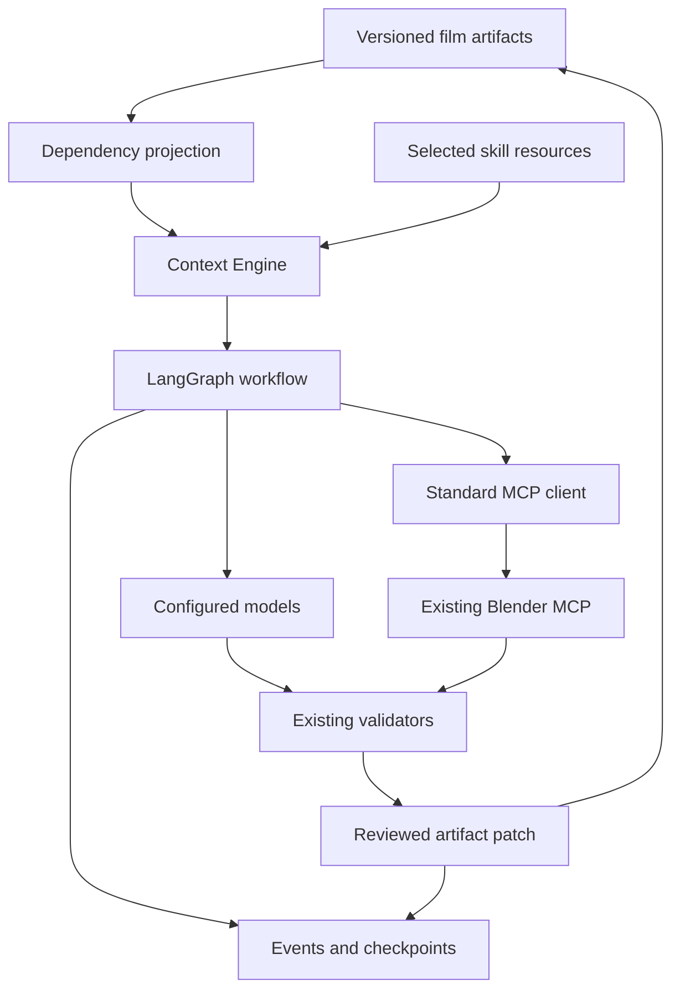

# Film OS Modernization Implementation Plan

> **For agentic workers:** REQUIRED SUB-SKILL: Use `superpowers:executing-plans` to implement this plan task by task. Steps use checkbox syntax. Use subagents only when separately authorized; this plan does not require delegation.

**Goal:** Add measurable, bounded context selection, source freshness, selective recomputation, and recoverable execution to the existing film planning core, using maintained community components.

**Architecture:** Keep the existing artifacts, 37 skills, and deterministic validators. Add an optional Python runtime that connects a film-specific dependency projection and Context Engine to LangGraph, standard MCP clients, and the already configured Blender MCP. Implement film rules and component wiring; reuse workflow, protocol, graph, patch, cache, evaluation, and telemetry machinery.

**Tech Stack:** Existing Python 3.11+, PyYAML, jsonschema, pytest; proposed optional dependencies: NetworkX, DiskCache, python-json-patch, LangGraph with SQLite checkpoints, official MCP Python SDK, LiteLLM, OpenTelemetry. SQLite is provided by Python. Promptfoo is a development-only evaluation tool.

**Spec:** The requirements and design sections in this document are the proposed modernization specification. Also read the September 13 direction amendment, September 14 freshness draft, and the separately saved September 17 Unified Versioning plan. Historical August specifications still define artifact semantics where this plan does not explicitly amend them.

**Status:** Implementation continues on `feature/film-os-modernization`, 2026-09-18. The branch now has the unified `0.3.0` contract, neutral profiles and examples, a non-destructive legacy migration CLI, optional runtime dependency declarations, six fixed replay cases, local usage/span telemetry, a NetworkX artifact projection, conservative file freshness comparison, an append-only SQLite journal, a 37-skill discovery registry, bounded L0-L3 context compilation, DiskCache reuse, checked JSON Patch/decision records, a one-artifact crash-safe publish boundary, finite model policy helpers, a DAG scene-plan compiler, a resumable LangGraph workflow backed by the official SQLite checkpointer, an official MCP SDK adapter with bounded receipts and schema checks, and a source-bound blocked Ninel pilot recipe/contract. The user's configured server identity, the Ninel pilot, and a real-provider behavioral comparison remain open. Component choices below are engineering recommendations, not previously approved user choices or tested integrations.

## 1. Verified starting point and branch

- Repository: [Arkus61/cine-agent-skills](https://github.com/Arkus61/cine-agent-skills).
- Published base: `88c8e75d2d14a9df050b67ceb465d610983cf138`, branch `feature/v2.0-chat-recovery`, open and unmerged [PR #1](https://github.com/Arkus61/cine-agent-skills/pull/1) when inspected.
- Modernization branch: `feature/film-os-modernization`, created from that published commit. Keep modernization commits here; do not merge PR #1 or change `main` as a planning side effect.
- The older local history ends at `e214c70e17e718fff936a12347ebf381567d080e`. Both bases have tree `edab9138185c718380dc6d09ef56aa28580bd178`; they do not have interchangeable ancestry. Never force-push the older history over GitHub.
- Current package metadata is `2.0.0`; the user's target is the single prerelease **0.3**, machine representation **0.3.0**. The unification plan is not implemented.
- Existing implementation: 37 skills, 35 subject schemas, strict package validators, `ProjectIndex`, CLI commands, test suite, and reproducible archive tooling.
- `ProjectIndex` is an immutable inventory of entity IDs, not a persistent dependency graph. `full-creative-pipeline` is an orchestration instruction, not an executable workflow engine.
- Freshness is a design draft. There is no implemented Context Engine, event store, runtime model router, durable executor, or live Blender acceptance evidence in this checkout.
- Existing `evals/*.json` contain scenarios and observables; their existence does not establish executed behavioral evaluations.
- The user's existing Blender MCP is authoritative. Its actual package, version, endpoint, and exposed capabilities have not been inspected in this session. No Blender tool is exposed to this session.
- Preserve the unrelated untracked `uv.lock` in the original checkout. Work in the isolated worktree.

## 2. Requirements recovered from the technical discussion

The relevant September 17 discussion was retrieved through prior-conversation search, not a complete exported transcript. These distinctions preserve the available evidence:

| Requirement | Evidence and disposition | Tasks |
|---|---|---|
| Separate modernization branch; reuse community tools | Explicit request in the current conversation | All |
| Return to Context Engine after preserving the architecture | Retrieved user preference | 4–7 |
| Blender through its existing MCP; no custom connector/protocol | Explicit user constraint, repeated in the technical discussion | 11–12 |
| Production Graph → context query/compiler → task capsule → skill/tools → validators → patch | Architecture proposed in the prior discussion | 3–12 |
| L0 Kernel, L1 Project, L2 Task, L3 Deep; progressive disclosure; context manifests and budgets | Prior architecture and saved project context | 5–6 |
| Artifact Graph, Event Store, Decision Ledger; source of truth outside chat | Prior architecture proposal | 3–4, 8 |
| Incremental build, content-addressed reuse, bounded model routing and decision gates | Prior architecture proposal | 7–10 |
| Scene Compiler, DAG, durable workflow, recovery | Prior architecture proposal | 10, 12 |
| Token telemetry, OpenTelemetry, evaluations and permission boundaries | Prior architecture proposal | 2, 8–13 |

Do not transfer unrelated Hermes research or its implementation claims into Film OS.

## 3. Global constraints

1. Target one active system version, `0.3.0`; no parallel generation profiles, separate skill version counters, or `3.x` label.
2. Keep the planning core usable offline without an LLM, Blender, a service account, or the optional runtime. Runtime provider calls are explicit configuration, never a new default dependency of validation.
3. Preserve scene, beat, movement, shot, character, asset, media and edit IDs; preserve script facts, assumptions, uncertainties and creative proposals as distinct data.
4. Structural validity, freshness, creative approval, and observed media readiness remain separate states. Cache hits, successful tool calls, and tests never grant creative approval.
5. No new film-specialist skills, web UI, producer operations, render farm, hosted service, general agent platform, or speculative media vendors in this modernization.
6. Use current validators as the Constraint Engine. Do not write a parallel rule language or bypass checks to improve token metrics.
7. Do not implement a Blender server, addon, socket client, or a Film OS ↔ Blender protocol. Standard MCP discovery and calls are the only integration boundary.
8. Current exact-membership validators reject extra files inside project and scene packages. Put runtime state in an explicit external `--state-dir`, never inside a validated package.
9. Repository documentation and code remain English. A separate Russian reader's brief can explain the plan to the user.
10. Pin and test exact dependency versions when each dependency enters implementation. Record license, Python compatibility, upstream revision, and the one capability being reused. Never assume that a currently installed API matches an example from another major version.
11. Scope the pilot to one local writer and one project. Multiple workers, distributed transactions, and arbitrary simultaneous external editing are outside the first acceptance contract.
12. Planning ends with a documented branch and roadmap. Implementation and merge are distinct work; this plan does not claim either has happened.

## 4. Community components and ownership

The selection is an inference from the repository's Python/local-first shape and the linked primary documentation, inspected on 2026-09-17. Documentation review is not an integration test.

| Need | Reuse | Film OS owns | Selection boundary |
|---|---|---|---|
| Skill discovery | [Agent Skills specification](https://agentskills.io/specification), existing YAML parser and skill validator | Task-to-skill mapping and required references | Keep native `SKILL.md`; first load names/descriptions, then the selected instructions and relevant resources |
| Dependency algorithms | [NetworkX DAG algorithms](https://networkx.org/documentation/stable/reference/algorithms/dag.html) | Artifact identities, explicit dependency edges, source provenance | Use cycle detection, ancestors, descendants and stable topological ordering; no graph database |
| Project journal | [SQLite transactions](https://www.sqlite.org/lang_transaction.html) | Small film-specific event/decision tables | Standard database, local single-writer pilot; no new event-bus or event-sourcing framework |
| Workflow and checkpoints | [LangGraph persistence](https://docs.langchain.com/oss/python/langgraph/persistence), [interrupts](https://docs.langchain.com/oss/python/langgraph/interrupts) | Node functions, budgets, readiness gates | Persistent SQLite checkpointer; no RAM-only recovery claim |
| Tool transport | [Official MCP Python SDK](https://github.com/modelcontextprotocol/python-sdk) | Configuration, capability requirements, call receipts | Reuse transports/discovery/lifecycle; no custom Tool Bus service |
| Blender | User's already configured Blender MCP | Declarative shot intent and a bounded recipe | [Community example](https://github.com/ahujasid/mcp-for-blender) is a reference, not evidence that this is the installed server |
| Model APIs, fallback, usage | [LiteLLM Router](https://docs.litellm.ai/docs/routing) | Task-class policy and quality threshold | SDK mode, optional; no separate proxy service or learned router |
| Patches | [python-json-patch](https://python-json-patch.readthedocs.io/en/latest/) | Allowed paths, expected source digest, validation | JSON Patch for JSON; normal textual diffs for Fountain/Markdown |
| Persistent result reuse | [DiskCache](https://grantjenks.com/docs/diskcache/tutorial.html) | Content key and reuse eligibility | Small trusted-local JSON/byte values; never depend on eviction cache for durable truth |
| Traces and metrics | [OpenTelemetry](https://opentelemetry.io/docs/specs/semconv/registry/attributes/gen-ai/) | Film IDs, stage names and policy-safe attributes | Local export first; pin the adopted conventions because the referenced GenAI registry has moved |
| Behavioral evaluation | [Promptfoo Python integration](https://www.promptfoo.dev/docs/integrations/python/) + existing pytest | Film fixtures and assertions backed by existing validators | Node.js is dev-only; no new custom evaluation platform |

### Alternatives considered

- **Temporal:** a real durable-workflow option ([official documentation](https://docs.temporal.io/workflows)), but adds service/worker operations for this local pilot. Select LangGraph now. Reconsider Temporal only for measured multi-machine or long-running job requirements; never install both merely because the architecture diagram names a workflow engine.
- **DVC:** already provides stage dependencies and run cache ([official documentation](https://doc.dvc.org/user-guide/pipelines/running-pipelines)). It is a good later fit for reproducible media files. Its stage commands/outputs and a dynamic interactive agent workflow need different lifecycle rules. Use LangGraph + NetworkX + DiskCache for this pilot; do not build a DVC competitor. If media versioning becomes necessary, use DVC directly and designate one scheduler per operation.
- **Neo4j/vector database/GraphRAG framework:** not needed to follow known entity IDs and explicit artifact edges. Start with exact lookup and graph traversal. Require a demonstrated retrieval miss before introducing semantic search.
- **Custom router, cache, workflow engine, MCP server, skill format:** rejected where the selected library already supplies the capability. A small domain adapter/configuration is acceptable; a duplicated general framework is not.

## 5. Target data flow and authority



| Data | Authority | Recovery |
|---|---|---|
| Authored film content and canonical IDs | Versioned project artifacts | Preserve source files and explicit snapshots |
| Dependency graph and lookup index | Derived projection + declared provenance edges | Rebuild from artifacts, dependency declarations and receipts |
| Events, decision evidence and operation receipts | Dedicated durable SQLite journal | Backup/export with project; corrections append events |
| In-progress workflow position | LangGraph persistent checkpointer | Resume with the same run/thread identity |
| Cached context/results | DiskCache | Disposable and rebuildable |
| Chat summaries | Non-authoritative convenience | Never restore project truth from a prose summary alone |

Do not store conflicting copies of all artifacts as independently editable database rows. Link an event, decision or result to artifact digests. LangGraph checkpoints and the event journal have separate jobs; they are not one atomic transaction with Blender or the filesystem.

### Runtime records

Put JSON record schemas in `runtime/schemas/`, not the existing subject `schemas/` catalog. Use the system version `0.3.0` in external runtime envelopes; dependency package versions remain their own upstream numbers.

- **ArtifactRef:** `project_id`, `artifact_key`, project-relative `path`, optional RFC 6901 `pointer`, stable `entity_ids`, `content_sha256`.
- **Dependency:** upstream/downstream artifact keys, `reason`, source evidence, digest used when authoring the downstream result. Do not infer authoritative edges from similar prose.
- **TaskRequest:** `task_id`, `project_id`, `target_ids`, `skill_name`, `intent`, `expected_inputs`, `input_budget`, `max_output_tokens`, `max_model_calls`, `max_tool_calls`.
- **ContextManifest:** included refs/digests/sections, excluded refs and reasons, required facts, unresolved inputs, estimated input tokens, tokenizer identity, kernel/skill/config hashes.
- **TaskCapsule:** request + bounded text/resources + context manifest. Tool descriptions and attachment estimates count toward the outbound input budget.
- **Event:** event/run/operation IDs, project, event kind, actor, causal event ID, input/output digests and evidence references. Runtime timestamps stay outside deterministic comparison payloads.
- **Decision:** scope, alternatives, evaluation criteria, selected alternative, concise reason, decision status, evidence and exact source digests. This is an audit rationale, not hidden model reasoning.
- **ToolReceipt:** discovered server/tool identity and schema hash, operation ID, argument hash, start/result status, observed outputs and digests. An ambiguous timeout is `outcome-unknown`.

### Context budget policy

L0 holds stable operating rules; L1 holds the project's applicable canon, constraints and version; L2 holds task targets, required dependencies and unresolved questions; L3 is fetched only for a specific missing detail. The normal starting capsule target is **2,000–6,000 input tokens**, not a guaranteed maximum for every film task.

Measure the full request, including selected tool schemas and content fetched after the first call. Reserve output and provider-specific overhead. Deduplicate by source identity/digest. Summaries link back to exact evidence and never replace required facts or approvals. If mandatory inputs exceed budget, split the task or return `needs-context`; do not silently drop constraints.

Keep stable instruction prefixes stable when a provider supports prompt caching. Track cached input separately from total input and actual cost; caching does not make tokens disappear. Host-managed prompts and tools may be outside Film OS control: report this limitation instead of claiming control of the full host context.

### Freshness and safe reuse

Implement the September 14 draft conservatively first: raw-file SHA-256, including when a node has a record pointer. A change to one record in a shared file can invalidate every dependent of that file. Record-local precision is not part of the first contract. The two-shot isolation fixture therefore uses separate source files.

Fresh/stale/unknown is computed against each result's recorded input digests. Capturing current files must not reset downstream freshness. No baseline or an unreadable input is unknown; a deleted known input is stale; report both kinds of evidence when both exist. Reuse only when the dependency coverage is declared and all relevant keys match.

Cache key inputs: task intent, source/constraint digests, selected skill/reference digests, schema/system/runtime revisions, model/provider parameters, tool/server capability version where applicable, and run variant/seed. Reuse cached deterministic preparations by default. Reusing a creative model result is explicit and never represents a new independent sample. Approval remains bound to an exact artifact revision and is checked separately.

## 6. Delivery sequence

Deliver three independently reviewable increments on the modernization branch. Each task is one bounded commit or small commit series. Do not open another optimization cycle after the acceptance gate passes.

| Increment | Tasks | Visible result |
|---|---|---|
| A. Measurable state | 1–4 | A consistent 0.3 foundation, real baseline, reproducible dependency/freshness report |
| B. Context and selective work | 5–8 | Explainable task capsules, safe patches, reuse of unaffected work |
| C. Recoverable execution | 9–13 | Bounded model calls, resumable workflow, existing Blender MCP pilot and before/after evidence |

### Task 1 — Consolidate versioning and integration authority

**Files:** existing `pyproject.toml`, `src/cine_skills/__init__.py`, `project_contracts.py`, schemas/templates/evals, `AGENTS.md`, `docs/CONTINUE.md`; import the current Unified Versioning plan into `docs/superpowers/plans/2026-09-17-unified-versioning.md` before executing its detailed tasks.

**Consumes → produces:** the separately saved 12-task versioning plan and current base → one `0.3.0` system plus an explicit optional-runtime boundary.

- [x] Read the current versioning plan; preserve the distinction between the approved version label and previously proposed migration details. Include the plan in the implementation review.
- [x] Execute its tasks for one version source, functional profiles, explicit non-destructive migration, current examples, CLI, packaging and consistency checks. Do not duplicate that migration implementation here.
- [x] Amend active instructions for the optional runtime and existing MCP integration. Supersede only conflicting frozen-scope statements; retain offline planning, evidence and ID guarantees. Mark the old custom Blender pilot design as superseded by reuse of existing MCP.
- [x] Verify migration keeps content, IDs, approvals and media revisions unchanged; record old/new commit and input/output digests.
- [x] Commit the versioning boundary before adding runtime behavior. If an independently completed versioning branch exists, integrate that verified commit normally instead of implementing the work twice. The active transition is fixed in `7f8c6bb`.

**Gate:** one machine version `0.3.0`; functional profiles `scene-core`, `scene-full`, `story`, `production`, `post`, `full-creative`; original user files preserved. No runtime task may create a second version source.

### Task 2 — Establish an honest baseline and standard telemetry

**Create:** `evals/film_os/cases.yaml`, `evals/film_os/promptfooconfig.yaml`, `evals/film_os/provider.py`, `evals/film_os/assertions.py`, `src/cine_skills/runtime/__init__.py`, `src/cine_skills/runtime/telemetry.py`, `tests/test_runtime_telemetry.py`.
**Modify:** `pyproject.toml` optional extras and `Makefile` evaluation targets.

**Interface:** `record_usage(run_id: str, task_id: str, usage: dict, source: str) -> dict`; `source` is `provider` or `estimate`. Preserve unknown counters as null, never zero.

- [x] Define six fixed cases: task capsule for one scene; a camera revision; character-look change affecting two scenes; unchanged rerun; interrupted run; missing media. Reuse current Ninel artifacts plus clearly labeled synthetic fault fixtures.
- [x] Wrap the current instructions in Promptfoo's Python provider and call existing validators from assertions. Keep raw outputs and observable results. Do not turn prose observables into automatic passes.
- [x] Capture actual baseline requests/usage where accessible; otherwise explicitly label a replay baseline and estimated token count. The current system already has progressive disclosure—do not fabricate an all-files prompt to inflate savings. The checked-in baseline is explicitly `replay-estimate` with no savings claim.
- [x] Add OpenTelemetry spans for task, context selection, validation, model call and tool call; record model, latency, input/output/cached tokens, call counts and repair counts. Export locally; omit raw project text by default. The optional runtime pins `opentelemetry-api==1.44.0` and `opentelemetry-sdk==1.44.0`.
- [x] Run the six cases with fixed inputs and recorded environment. Store metrics and failures, then commit only sanitized fixtures/configuration/report; avoid committing private transcripts. The local replay report validates all six cases; Promptfoo's external execution remains an explicit opt-in.

Minimum regression:

```python
def test_missing_usage_is_not_reported_as_free():
    from cine_skills.runtime.telemetry import record_usage
    row = record_usage("run-1", "camera-1", {}, "provider")
    assert row["input_tokens"] is None
    assert row["cost"] is None
```

**Gate:** reproducible baseline files distinguish measured, estimated and unavailable values. No token-saving claim yet.

### Task 3 — Add the artifact dependency projection

**Create:** `src/cine_skills/runtime/artifact_graph.py`, `runtime/schemas/artifact-graph.schema.json`, `runtime/config/artifact-dependencies.yaml`, `tests/test_artifact_graph.py`.
**Reuse unchanged:** `project_package.build_project_index`, schema and reference validators; the graph does not replace `ProjectIndex`.

**Interface:** `build_artifact_graph(project_dir: Path, root: Path, declarations: dict) -> networkx.DiGraph`; `affected_nodes(graph: networkx.DiGraph, changed: set[str]) -> list[str]` returns sorted changed nodes plus downstream closure.

- [ ] Map source, story, screenplay, scene, production and post artifacts to stable keys using their existing manifests/IDs. Keep generation dependencies separate from ordinary reference links, which may contain cycles.
- [ ] Write tests for disconnected shot branches, a shared character-look source, a missing endpoint and a dependency cycle.
- [ ] Implement traversal with NetworkX and loading with existing validation helpers. Reject malformed dependencies, unsafe paths and conflicting project IDs.
- [ ] Store declared coverage and provenance. Missing declared inputs remain visible and unresolved; the projection must not require a complete valid final project before partial story work can begin.
- [ ] Run `python -m pytest tests/test_artifact_graph.py -q`; commit mapping, tests and projection together.

```python
def test_camera_change_preserves_other_branch():
    import networkx as nx
    from cine_skills.runtime.artifact_graph import affected_nodes
    graph = nx.DiGraph([("camera-1", "preview-1"), ("camera-2", "preview-2")])
    assert affected_nodes(graph, {"camera-1"}) == ["camera-1", "preview-1"]
```

**Gate:** only declared generation dependencies determine invalidation; no copied downstream registry becomes authoritative source data.

### Task 4 — Persist provenance, events and freshness

**Create:** `src/cine_skills/runtime/state.py`, `src/cine_skills/project_freshness.py`, `runtime/schemas/freshness-snapshot.schema.json`, `tests/test_project_freshness.py`, `tests/test_runtime_state.py`.

**Interfaces:** `capture_sources(project_dir: Path, nodes: list[dict]) -> dict`; `compare_sources(project_dir: Path, snapshot: dict) -> dict` returns sorted `fresh`, `stale`, `unknown`, `reasons`, and `coverage`. `append_event(database: Path, event: dict) -> str` returns the existing ID for an identical duplicate operation; conflicting reuse fails.

- [ ] Add a SQLite journal with unique operation IDs, input/output digests, causal events, decisions and receipts. Use transactions; refuse journal updates/deletions through the application API. Document that this is not a tamper-proof ledger against the machine owner.
- [ ] Implement explicit capture and read-only compare using SHA-256 and the approved draft's file-level semantics.
- [ ] Test changed/missing/unreadable inputs, no baseline, cycles, traversal/symlinks, duplicate operations and a deleted rebuildable projection.
- [ ] Keep generation receipts separate from a newly captured source inventory so recapture cannot make obsolete results appear fresh. Ensure compare writes no source, output or baseline bytes.
- [ ] Run `python -m pytest tests/test_project_freshness.py tests/test_runtime_state.py -q`; commit.

```python
def test_change_under_stable_id_is_stale(tmp_path):
    from cine_skills.project_freshness import capture_sources, compare_sources
    source = tmp_path / "camera.json"
    source.write_text('{"shot_id":"S01-SH001","x":0}', encoding="utf-8")
    snapshot = capture_sources(tmp_path, [{"key":"camera-1", "path":"camera.json"}])
    source.write_text('{"shot_id":"S01-SH001","x":1}', encoding="utf-8")
    assert compare_sources(tmp_path, snapshot)["stale"] == ["camera-1"]
```

**Gate A:** the dependency and freshness reports are reproducible; missing evidence cannot become fresh or approved.

### Task 5 — Generate a small skill registry

**Create:** `src/cine_skills/runtime/skill_registry.py`, `runtime/config/skill-context.yaml`, `tests/test_context_skill_registry.py`.
**Modify only when justified:** the selected pilot skills' `SKILL.md` and local references; all skill edits remain tracked and synchronized with Git.

**Interface:** `build_skill_registry(skills_dir: Path) -> list[dict]`, containing `name`, `description`, `path`, `digest`, `required_refs` and conditional reference rules.

- [ ] Reuse existing frontmatter parsing and validation. If the versioning work supplies a system manifest, use it for membership rather than a second hand-maintained catalog.
- [ ] Emit only discovery metadata initially; retain all 37 skills without loading all bodies or templates into every task.
- [ ] Audit pilot skills for unconditional "read all references" instructions. Preserve mandatory content; change to conditional reading only where a scenario proves it safe. Never ignore an instruction merely to meet a budget.
- [ ] Test that unselected skill bodies are not read, required references remain present, changed files alter digests, and links remain within the skill folder.
- [ ] Run `python -m pytest tests/test_context_skill_registry.py tests/test_skill_catalog.py -q`; commit registry/config and any reviewed skill edits.

**Gate:** all skills remain portable Agent Skills. Discovery, activation and detailed resource loading are separately observable in the trace.

### Task 6 — Compile Task Context Capsules

**Create:** `src/cine_skills/runtime/context.py`, `runtime/schemas/task-request.schema.json`, `runtime/schemas/context-manifest.schema.json`, `runtime/config/context-policy.yaml`, `tests/test_task_context.py`.

**Interface:** `compile_context(request: dict, graph: networkx.DiGraph, registry: list[dict], project_dir: Path, token_counter: Callable[[str], int]) -> dict`, with `status`, `text`, `manifest`; status is `ready`, `needs-context`, or `blocked`. The counter is injected for offline tests and uses an existing model tokenizer in actual runs.

- [ ] Define task contracts for `camera-movement-designer`, `shot-list-builder` and `storyboard-designer` first. Include project constraints and cross-scene continuity where applicable, not just the closest graph node.
- [ ] Assemble L0–L3 in deterministic order from exact refs/digests; eliminate duplicates and superseded versions. Never use stale summaries as canon.
- [ ] Record why every item was included/excluded. Allow additional exact reference reads under the same task budget and record their cost.
- [ ] Test small/oversized mandatory context, changed canon, wrong project, required continuity, missing sources and an attempted instruction embedded in source content. Source prose remains data, not authority to change task rules.
- [ ] Run `python -m pytest tests/test_task_context.py -q`; compare actual serialized request sizes with Task 2; commit.

**Minimum test case:** a request for shot A has two required refs totaling 400 tokens, one optional 200-token reference and a 500-token budget; keep both required refs and exclude the optional one with reason `budget`. With a 300-token budget, return `needs-context`, name both required refs, and do not invoke a model.

**Gate:** a reviewer can reconstruct the task inputs from its manifest; no saved provenance, constraint or approval is silently truncated.

### Task 7 — Reuse unaffected computations with an existing cache

**Create:** `src/cine_skills/runtime/result_cache.py`, `tests/test_runtime_cache.py`.

**Interface:** `result_key(manifest: dict, execution: dict) -> str`; `lookup_result(cache_dir: Path, key: str) -> dict | None`; `store_result(cache_dir: Path, key: str, result: dict) -> None` delegate persistence to DiskCache.

- [ ] Build deterministic keys from the inputs listed in section 5; serialize plain JSON or bytes, not arbitrary pickled external objects.
- [ ] Cache deterministic context/validation preparation and recorded results; keep authoritative evidence outside the eviction cache.
- [ ] Reuse only after checking current input digests, dependency coverage and output integrity. Disable model-result reuse for independent evaluation repetitions or an explicit regenerate request.
- [ ] Test unchanged hit, changed source, skill, schema, model/tool configuration, missing/corrupt output, and expired cache. Approval changes are checked even when content has a cache hit.
- [ ] Run `python -m pytest tests/test_runtime_cache.py -q`; commit. If measured reuse is negligible, keep the feature optional instead of expanding cache machinery.

```python
def test_model_change_is_not_a_cache_hit():
    from cine_skills.runtime.result_cache import result_key
    manifest = {"input_digests": {"camera-1": "a" * 64}, "skill_digest": "b" * 64}
    assert result_key(manifest, {"model":"A"}) != result_key(manifest, {"model":"B"})
```

**Gate:** an unchanged deterministic rerun needs zero new model calls; a cache hit never conceals a stale dependency or upgrades approval.

### Task 8 — Apply checked patches and record decisions

**Create:** `src/cine_skills/runtime/patches.py`, `src/cine_skills/runtime/decisions.py`, `tests/test_runtime_patches.py`, `tests/test_runtime_decisions.py`.

**Interfaces:** `stage_json_patch(original: dict, operations: list[dict]) -> dict` uses python-json-patch without in-place mutation; `check_base(actual_digest: str, expected_digest: str) -> list[str]`; `record_decision(database: Path, decision: dict) -> str` validates evidence binding before appending.

- [ ] Produce a candidate patch against an exact base digest, apply in a separate staging copy, and invoke the existing artifact/package validators on the assembled candidate.
- [ ] Protect canonical IDs and approval/evidence fields unless an explicit authorized edit targets them. Human review events must name the exact candidate digest.
- [x] For the pilot publish one artifact at a time in an exclusive task workspace: `runtime.publish.publish_artifact` journals the intended operation and bytes, atomically replaces that file, then appends a receipt. On restart it reconciles only an exact candidate digest; unknown bytes produce a conflict, not an overwrite. This remains a one-file boundary and does not claim a multi-file transaction or coordination with arbitrary external editors.
- [ ] For consequential ambiguous creative choices compare up to three short alternatives under one budget. Store criteria, choice and rationale; do not require multiple model calls for routine formatting, hashing or validation.
- [x] Test the publish slice's base conflict, receipt gap, unknown bytes, preserved original on validation failure and unsafe paths in `tests/test_runtime_publish.py`. Existing patch/decision tests cover rejected schema/ID changes and approval provenance; run both focused test modules and commit.

```python
def test_patch_does_not_mutate_its_input():
    from cine_skills.runtime.patches import stage_json_patch
    original = {"camera": {"x": 0}}
    candidate = stage_json_patch(original, [{"op":"replace", "path":"/camera/x", "value":1}])
    assert original["camera"]["x"] == 0
    assert candidate["camera"]["x"] == 1
```

**Gate B:** one camera change produces a traceable validated patch and only the declared downstream closure becomes stale. Rejected candidates leave original content intact.

### Task 9 — Configure model routing with hard call budgets

**Create:** `src/cine_skills/runtime/models.py`, `runtime/config/model-policy.example.yaml`, `tests/test_model_policy.py`.

**Interface:** `select_model(task_class: str, available: dict) -> str | None`; `remaining_calls(limit: int, used: int) -> int`. Provider calls use LiteLLM, not new vendor clients.

- [ ] Classify deterministic operations as no-model work. Configure small-context drafting, difficult creative decisions and synthesis as policy classes, not hardcoded provider/model names.
- [ ] Keep the default offline/unconfigured. Permit local providers or existing user-configured remote providers; do not add paid subscriptions or require API access to run validators.
- [ ] Start with a task budget of two model calls total (initial plus one repair), three alternatives maximum within a decision response, and ten tool calls. Transport attempts count toward configured limits; one layer owns retries to prevent multiplicative retry storms.
- [ ] Escalate only when a configured model satisfies the task capabilities and the remaining budget; otherwise return a concrete blocked reason. Every request is re-counted after adding tool schemas and fetched context.
- [ ] Use fake providers to test routing, no-model paths, budget exhaustion and unavailable fallbacks; run `python -m pytest tests/test_model_policy.py -q`; commit.

```python
def test_budget_cannot_become_negative():
    from cine_skills.runtime.models import remaining_calls
    assert remaining_calls(limit=2, used=2) == 0
    assert remaining_calls(limit=2, used=3) == 0
```

**Gate:** no unlimited repair loop, implicit paid provider or self-written model API transport.

### Task 10 — Assemble a recoverable LangGraph workflow

**Create:** `src/cine_skills/runtime/workflow.py`, `src/cine_skills/runtime/scene_plan.py`, `tests/test_runtime_workflow.py`, `tests/test_scene_execution_plan.py`.

**Interfaces:** `compile_scene_plan(graph: networkx.DiGraph, targets: list[str], freshness: dict) -> list[dict]` yields ordered task records with `task_id`, `inputs`, `outputs`, `skill_name`, `operation_kind`; `build_workflow(config: dict, state_dir: Path)` returns a LangGraph graph compiled with persistent checkpoints.

- [x] Compile the existing artifact dependencies into tasks using NetworkX ordering; the "Scene Compiler" is this mapping, not a new scripting language or a second scheduler.
- [x] Implement the workflow nodes: validate inputs, choose context, reuse/execute, validate candidate, review if required, publish artifact, record result. Reuse Task 4–9 functions.
- [x] Use LangGraph persistence and interrupts for pause/resume. Store artifact refs and receipts in graph state, not every project document or a forever-growing chat history. The optional runtime pins `langgraph==1.2.11` and `langgraph-checkpoint-sqlite==3.1.1`.
- [x] Test restart after context compilation and after a result has been journaled but before checkpoint acknowledgement. Reconcile operation IDs before a side effect; if an external result is ambiguous, block for observation instead of replaying it blindly.
- [x] Run `python -m pytest tests/test_runtime_workflow.py tests/test_scene_execution_plan.py -q`; 8 tests pass with the runtime extra.

**Acceptance case:** a fake external action increments a durable counter, writes its receipt, then the process is terminated before workflow advancement. Resume the same run. The counter remains one and the workflow uses the recorded receipt. A second case without a receipt ends `outcome-unknown`; it must not claim exactly-once execution.

**Gate:** repeatable crash recovery and finite budgets, without a custom workflow engine or a second Temporal deployment.

### Task 11 — Use standard MCP and the existing Blender connection

**Create:** `src/cine_skills/runtime/mcp_client.py`, `runtime/config/mcp.example.json`, `tests/test_runtime_mcp.py`; a capability inventory is saved under the external state directory.

**Interface:** `inspect_server(config: dict) -> dict` and `call_tool(config: dict, tool_name: str, arguments: dict, operation_id: str) -> dict` are async functions using official SDK sessions and discovered schemas. A receipt is returned even for an observed failure.

- [x] Implement the official SDK adapter with stdio, Streamable HTTP and SSE configuration paths, allowlisted tools, Draft 2020-12 argument checks, bounded output, capability inventory and external receipt files. Pin `mcp==2.2.0`; offline tests use a fake session without replacing the SDK boundary.
- [ ] Read the existing configured Blender MCP identity and transport when accessible. Do not reinstall or replace it because an online example uses a different package name.
- [ ] Negotiate through the SDK, list capabilities and record server/protocol/package version plus input schemas. Test the chosen SDK major with that actual server; lock the working versions.
- [x] Route only task-required tool descriptions into context. Validate arguments and configured operation scope before calls; do not trust a tool description as permission.
- [ ] Limit modifying actions to a disposable pilot scene/project and preserve a pre-operation copy. If the existing server exposes only arbitrary Python execution, run reviewed bounded recipes with validated parameters; do not design a new connector to hide that capability.
- [x] Test disconnected server, changed tool schema, malformed arguments and oversized output with mocks. Run one live read-only capability/scene inspection when available and save its receipt; this live gate remains open until the configured server is accessible.

**Gate:** real evidence confirms the installed server. Passing mocks while Blender is unavailable is an incomplete integration, not a reason to invent a replacement.

### Task 12 — Demonstrate one Ninel scene and one revision

**Create:** `runtime/recipes/ninel-blocking.yaml`, `evals/film_os/pilot-contract.yaml`, `tests/test_pilot_contract.py`; pilot output lives outside exact-membership source packages.

**Consumes → produces:** validated shot intent, the compiled scene plan, and actual MCP capabilities → observed blockout/camera previews with source-bound receipts.

- [x] Add a source-bound blocked recipe and pilot contract that name the two independent shot branches, external output root, required evidence and no-arbitrary-Python boundary. This preparation does not count as live Blender evidence.

- [ ] Copy one existing Ninel scene to a disposable pilot workspace and label it demonstration material, not approved series canon. Keep two independent shot source files to test selective invalidation honestly.
- [ ] Through existing MCP capabilities create or update simple environment blocks, subject placeholders and camera poses/path; record coordinate system, scale, frame rate and any unavailable facts as assumptions before execution.
- [ ] Obtain a scene view/preview for the start, middle and end of the camera action, if the installed server supports this. Check actual object transforms, lens and frame coverage against intent; image existence alone is not acceptance.
- [ ] Change the first camera under its stable shot ID and rerun. The first dependency branch updates; the second branch's artifact digests and operation counters remain unchanged.
- [ ] Interrupt and resume once; preserve the last verified scene/result. Record previews, receipts, declared limitations and human creative-review status; commit only non-sensitive configuration/acceptance evidence.

**Gate:** observed Blender outputs, selective revision and recovery all demonstrated. A storyboard instruction or schema-valid JSON cannot substitute for this live gate. Unsupported camera semantics remain explicit gaps in the recipe, not claimed native MCP features.

### Task 13 — Prove the improvement and close the scope

**Modify:** `Makefile`, `.github/workflows/ci.yml`, `README.md`, `docs/CONTINUE.md`, `docs/source-register.md`; create `docs/film-os-modernization-results.md` and tracked optional-dependency lock files separate from the unrelated original `uv.lock`.

- [ ] Compare baseline and optimized variants on the same six cases and model configuration: three paired repetitions, cold and warm caches reported separately. Disable evaluation-response reuse for independent samples. Report individual cases as well as the median; this is a pilot, not a broad statistical claim.
- [ ] Require no regression in ID/reference/approval/unknown-state checks, no loss of mandatory facts, and no worse expert rubric outcome in the reviewed cases. The proposed engineering target is at least **30% lower median total input tokens per successful task**, counting all calls; it is a target, not an achieved result or an upstream claim.
- [ ] Require unchanged deterministic reruns to make zero model calls; require the camera revision and crash cases to meet their explicit gates. Report latency, output tokens, cost only where known, human corrections and tool-call count alongside input tokens.
- [ ] Run the regression suite and all example targets, then install the core without runtime extras in a clean environment. Exercise optional runtime separately with fake providers; run the live Blender gate only where the configured server is available.
- [ ] Update documentation with exact commits, environment, measured results, missing evidence and rollback instructions. Stop after the gates. Prepare a reviewable diff; merging or publishing a release is a separate action.

After the versioning prerequisite, the final core gate is:

```bash
make check-version
make check
make validate-scene-core-example
make validate-scene-full-example
make validate-story-example
make validate-production-example
make validate-post-example
make validate-project-example
make release-archive
git diff --check
```

Task 13 adds `make eval-film-os` for the checked-in Promptfoo configuration and `make check-film-os` for runtime tests. Keep these additions separate from offline core installation requirements.

## 7. Rollout, stop conditions and deferred work

Activate optional runtime features individually after their gates: freshness/context first, cached reuse and patches second, model/workflow execution third, Blender pilot last. The old planning-only flow stays usable throughout. Rollback disables the optional feature/configuration and restores an explicit verified artifact snapshot; it does not delete audit history or manufacture new approvals.

Stop and report a concrete gap when a needed source is unavailable, a dependency cannot be accounted for, mandatory context exceeds budget, an external action has an unknown outcome, or quality falls below baseline. Continue other independent plan tasks where useful; do not fill the gap with invented evidence.

Deferred until a measured need: full record-level hashing, distributed workers, Temporal, DVC media storage, semantic retrieval/vector databases, learned routing, automatic prompt compression, broad parallel specialist execution, complete vendor media generation, and additional creative roles. These are not hidden completion requirements for this plan.

## 8. Plan completion and evidence

The planning deliverable is complete when its source/base is recorded, community choices have primary links and bounded responsibilities, all discussion themes map to tasks, the separate branch contains this document, and the user receives a concise Russian explanation. Implementation checkboxes remain empty until executed.

Implementation completion requires Gates A, B and C plus the measured report. A large test count alone does not prove token savings, creative quality, live MCP behavior, freshness coverage or media readiness.
